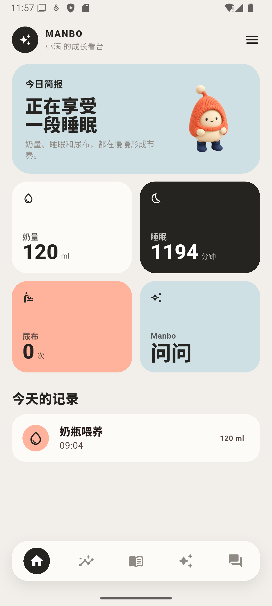
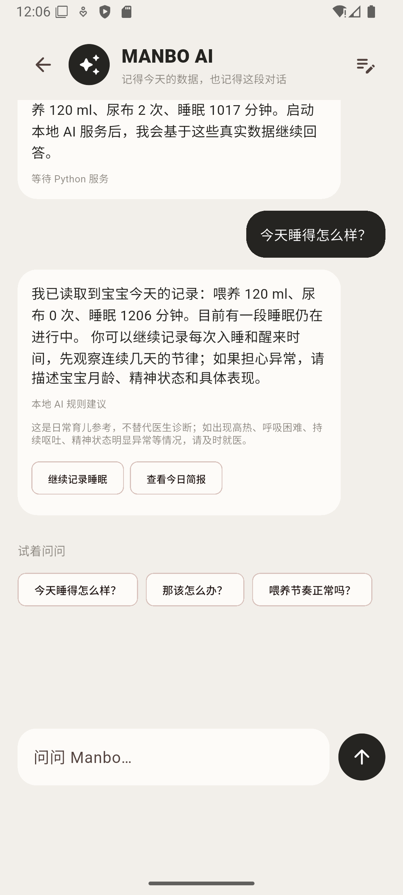
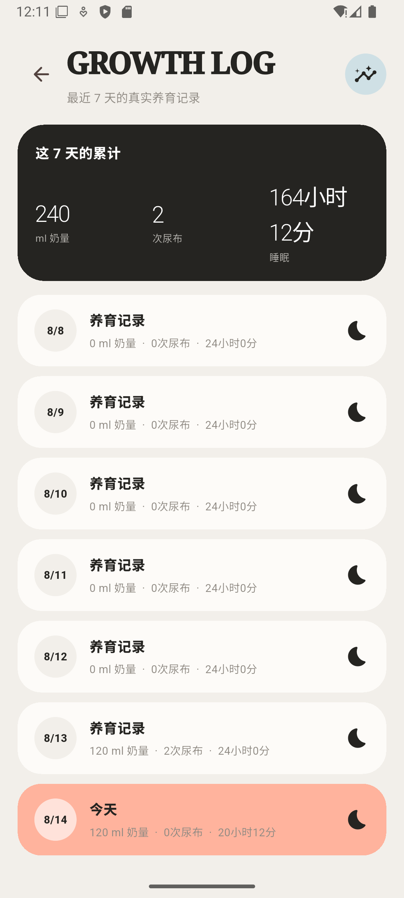
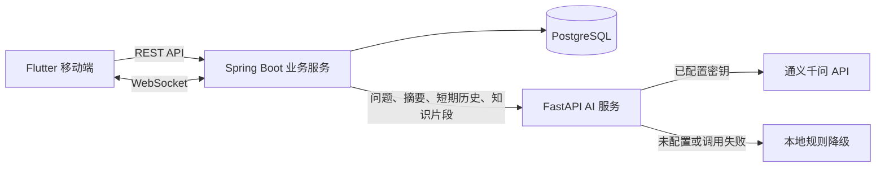

<div align="center">


# Manbo 母婴 AI 助手

一款围绕宝宝成长记录、AI 育儿问答与家庭协作打造的全栈移动应用。

Flutter 客户端 · Spring Boot 业务服务 · FastAPI AI 服务 · PostgreSQL 数据库

</div>

> 当前版本是作品集阶段的可运行 Demo，用于展示移动端、Java 后端、Python AI 服务与数据库的完整协作流程，不是可直接上线的医疗产品。

## 界面预览

<p align="center">
  
  
  
</p>

<p align="center"><sub>成长看台 · AI 育儿助理 · 七天成长记录</sub></p>

## 项目介绍

Manbo 希望把零散的喂养、睡眠和尿布记录，整理成家长能够轻松理解的成长信息。应用采用奶油灰背景、不对称 Bento 卡片和原创角色，减少传统数据报表带来的压迫感。

整个项目采用 Java + Python 混合架构：Java 负责用户、宝宝、养育记录、会话与家庭协作等稳定业务；Python 负责 AI Prompt 组装、大模型调用和本地降级回答；Flutter 通过 REST API 与 WebSocket 使用这些能力。

## 已实现功能

- **系统化养育记录**：记录奶瓶喂养、尿布和睡眠开始/结束，数据保存到 PostgreSQL。
- **今日简报**：自动汇总当天奶量、尿布次数、睡眠时长与当前睡眠状态。
- **成长时间线**：展示最近 7 天的养育记录和累计趋势。
- **Manbo AI 育儿助理**：结合当天真实记录、最近会话和审核过的知识片段回答问题。
- **Qwen 接入与透明降级**：配置密钥时调用通义千问；未配置或服务异常时使用明确标识的本地规则回答。
- **育儿知识资源**：按标题、内容、来源和适用月龄保存并查询知识文章。
- **账号与家庭成员**：支持注册、登录、JWT 会话、家庭邀请码和成员身份校验。
- **家庭私密聊天**：消息保存到 Java/PostgreSQL，并通过 WebSocket 实时同步。
- **多尺寸适配**：Flutter 页面针对常见手机宽度进行了布局与溢出测试。

## 系统架构



### 职责划分

| 模块 | 主要职责 | 技术栈 |
| --- | --- | --- |
| `baby_assistant_app` | 页面、交互、状态展示、REST/WebSocket 调用 | Flutter、Dart |
| `baby_assistant_server` | 业务编排、鉴权、养育记录、会话、家庭聊天、数据持久化 | Java 17、Spring Boot、MyBatis、Flyway |
| `baby_assistant_ai` | Prompt 组装、Qwen 调用、本地规则降级 | Python、FastAPI、Uvicorn |
| 数据库 | 用户、宝宝、记录、知识文章、AI 会话、家庭消息 | PostgreSQL |

## 项目结构

```text
manbo-AI/
├── baby_assistant_app/       # Flutter Android/iOS 客户端
├── baby_assistant_server/    # Spring Boot Java 业务服务
├── baby_assistant_ai/        # FastAPI Python AI 服务
├── docs/screenshots/         # README 效果图
├── README.md
└── SECURITY.md
```

## 本地运行

### 1. 环境要求

- Flutter SDK 与 Android 模拟器
- Java 17
- Maven 3.9+
- Python 3.11+
- PostgreSQL

### 2. 准备 PostgreSQL

创建本地数据库 `baby_assistant` 和用户 `baby_app`，密码通过环境变量提供。Java 服务启动时会由 Flyway 自动创建和升级表结构。

### 3. 启动 Java 服务

```powershell
cd baby_assistant_server
$env:BABY_DATABASE_PASSWORD = "你的本地数据库密码"
mvn spring-boot:run
```

健康检查：`http://localhost:8080/api/v1/health`

### 4. 启动 Python AI 服务

```powershell
cd baby_assistant_ai
python -m venv .venv
.\.venv\Scripts\pip.exe install -r requirements.txt

# 可选；不配置时使用本地规则降级，不影响基础联调
$env:DASHSCOPE_API_KEY = "你重新申请的密钥"

.\.venv\Scripts\python.exe -m uvicorn app.main:app --reload --port 8000
```

- 健康检查：`http://localhost:8000/health`
- 接口文档：`http://localhost:8000/docs`

### 5. 启动 Flutter 客户端

```powershell
cd baby_assistant_app
flutter pub get
flutter run
```

Android 模拟器默认访问 `http://10.0.2.2:8080/api/v1`。真机调试时可通过以下方式替换为电脑的局域网地址：

```powershell
flutter run --dart-define=BABY_API_BASE_URL=http://你的电脑IP:8080/api/v1
```

## 环境变量

| 变量 | 是否必须 | 用途 |
| --- | --- | --- |
| `BABY_DATABASE_PASSWORD` | 是 | PostgreSQL 密码 |
| `BABY_DATABASE_URL` | 否 | Java 数据库地址 |
| `BABY_DATABASE_USERNAME` | 否 | Java 数据库用户名 |
| `BABY_JWT_SECRET` | 生产环境必须 | JWT 签名密钥；本地未配置时使用启动期随机密钥 |
| `BABY_AI_SERVICE_BASE_URL` | 否 | Python AI 服务地址，默认 `http://localhost:8000` |
| `DASHSCOPE_API_KEY` | 否 | 通义千问 API 密钥 |
| `QWEN_MODEL` | 否 | Qwen 模型名称，默认 `qwen-plus` |

真实密钥只应放在环境变量、IDE 运行配置、CI Secret 或部署平台的密钥管理服务中。仓库只提供 `.env.example` 占位示例。

## 测试

```powershell
# Flutter
cd baby_assistant_app
flutter analyze
flutter test

# Java
cd ..\baby_assistant_server
mvn test

# Python
cd ..\baby_assistant_ai
.\.venv\Scripts\python.exe -m unittest discover -s tests
```

## 后续计划

- 为全部宝宝数据接口补齐统一鉴权与数据归属校验。
- 将 Flutter 登录令牌迁移到系统安全存储。
- 增加向量检索、查询改写、月龄过滤与重排序，完善 RAG 知识库。
- 增加语音记录、高清育儿资源和对象存储。
- 增加 Redis 会话缓存、上下文摘要、限流、监控与云端部署。
- 补充隐私政策、用户授权和生产级医疗安全提示。

## 安全与免责声明

- 当前项目仅用于学习、演示和作品集展示，请勿直接暴露到公网。
- 家庭聊天与邀请码已进行登录和成员校验；其他宝宝数据接口仍需统一补充归属鉴权。
- 请勿在演示数据库中使用真实家庭隐私数据。
- AI 回答仅供日常育儿参考，不能替代医生诊断；出现高热、呼吸困难、持续呕吐、精神状态明显异常等情况时应及时就医。
- 安全问题与密钥处理方式见 [SECURITY.md](SECURITY.md)。
